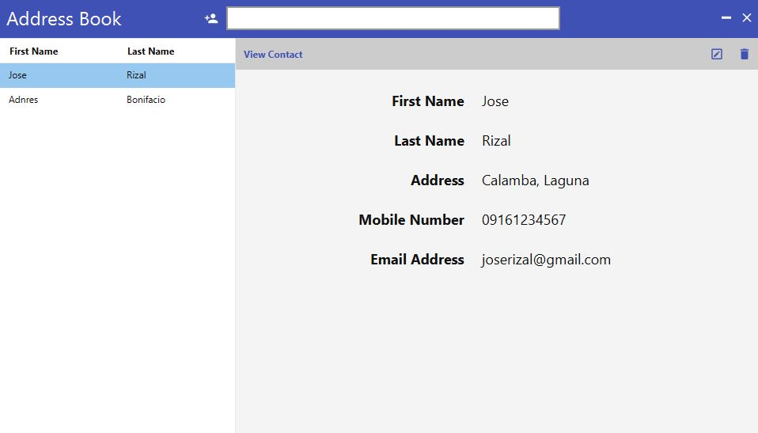
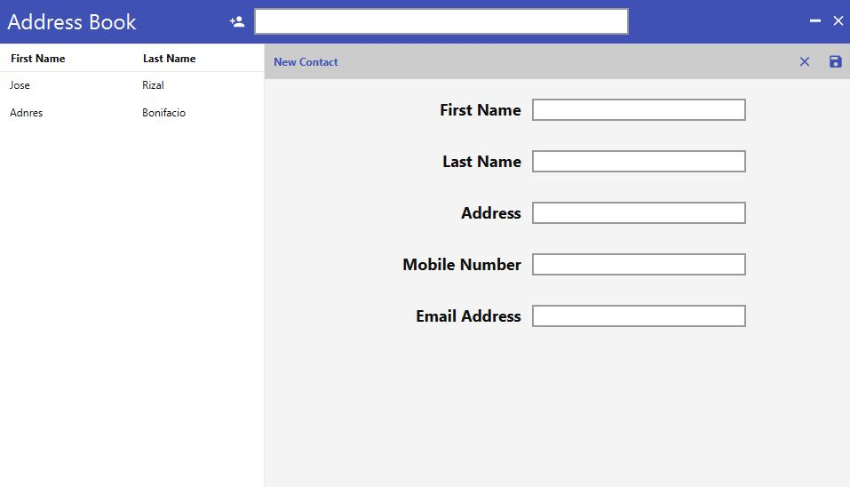
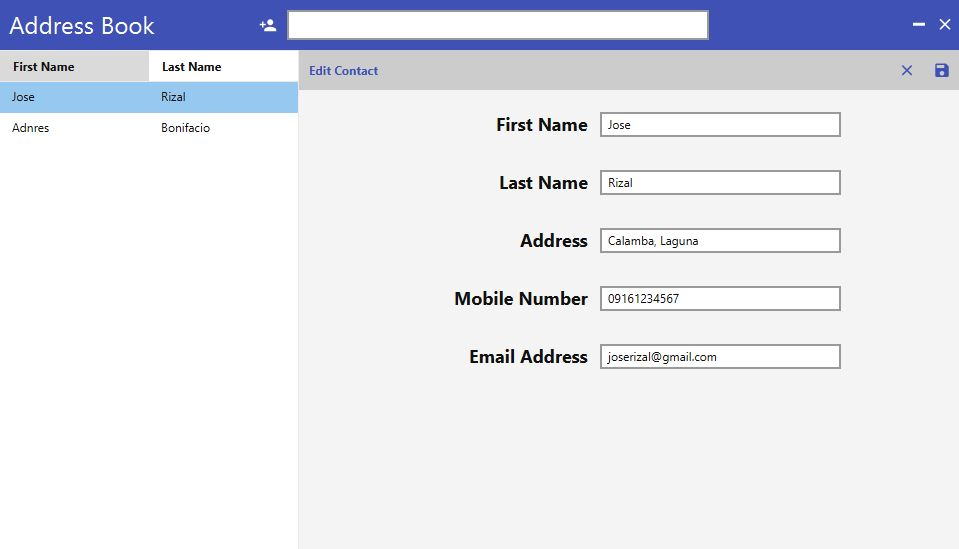
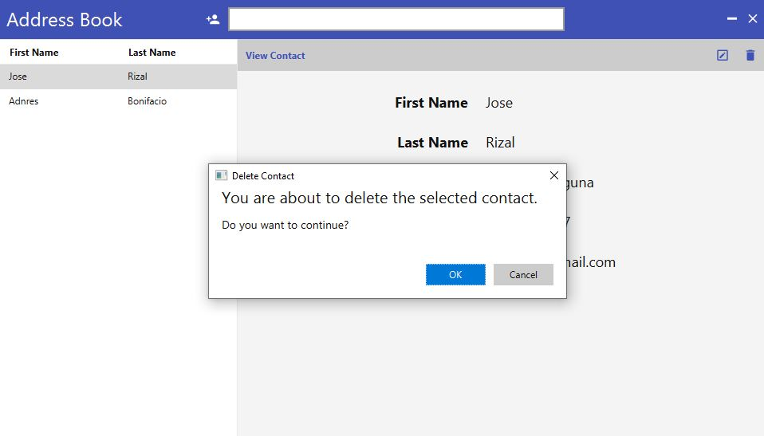
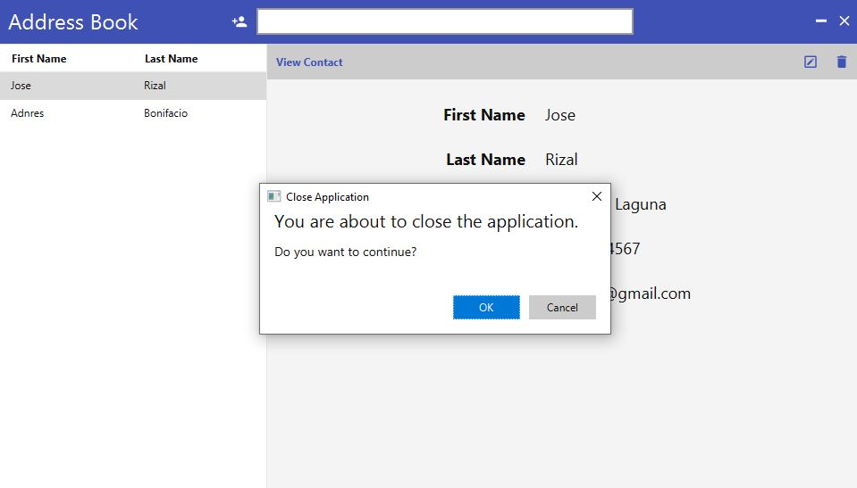

# addressbook-javafx-hibernate-mysql

Address book application written in JavaFX with Hibernate ORM, Hibernate Validator, HikariCP frameworks and MySQL database.

## Clone

```bash
$ git clone https://github.com/julianjupiter/addressbook-javafx-hibernate-mysql
```

# Database

Create database `addressbook` in MySQL Server and create the following table (also in `src/main/resources/database.sql`):

```sql
CREATE TABLE IF NOT EXISTS contact (
    id BIGINT NOT NULL AUTO_INCREMENT,
    last_name VARCHAR(255) NOT NULL,
    first_name VARCHAR(255) NOT NULL,
    address VARCHAR(255) NOT NULL,
    mobile_number VARCHAR(255) NOT NULL,
    email_address VARCHAR(255) NOT NULL,
    created_at DATETIME NOT NULL DEFAULT CURRENT_TIMESTAMP,
    updated_at DATETIME DEFAULT CURRENT_TIMESTAMP ON UPDATE CURRENT_TIMESTAMP,
    PRIMARY KEY(id)
);

INSERT INTO contact(last_name, first_name, address, mobile_number, email_address) VALUES
('Rizal', 'Jose', 'Calamba, Laguna', '09161234568', 'joserizal@gmail.com'),
('Bonifacio', 'Andress', 'Tondo, Manila', '09161234569', 'andresbonifacio@gmail.com');
```

## Build and Run

- GNU/Linux, UNIX

```bash
$ cd addressbook-javafx-hibernate-mysql
$ ./mvnw clean package
$ java -jar java -jar ./target/addressbook-javafx-hibernate-mysql-0.0.3.jar
```

- Windows

```bash
> cd addressbook-javafx-hibernate-mysql
> .\mvnw clean package
> java -jar java -jar .\target\addressbook-javafx-hibernate-mysql-0.0.3.jar
```

## Note

Search has not been implemented yet.

## Screenshots

#### Start


#### View Contact


#### Edit Contact


#### Add Contact


#### Search Contact


#### Delete Contact


#### Close Application
